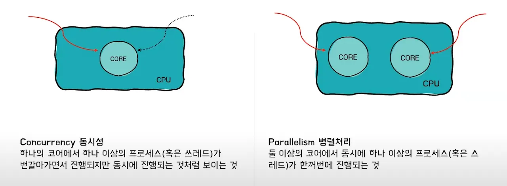
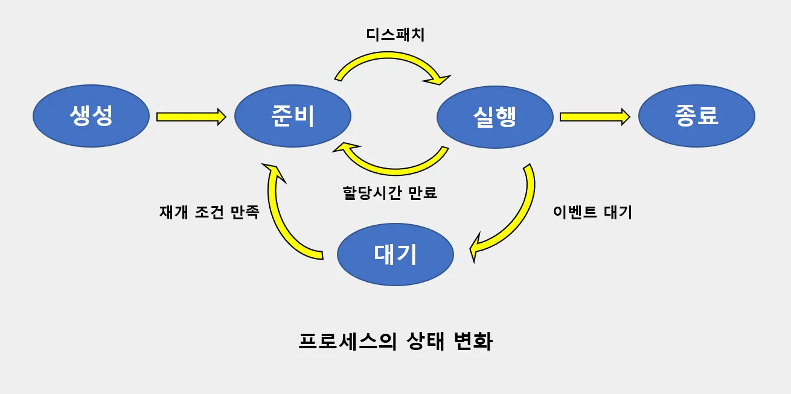
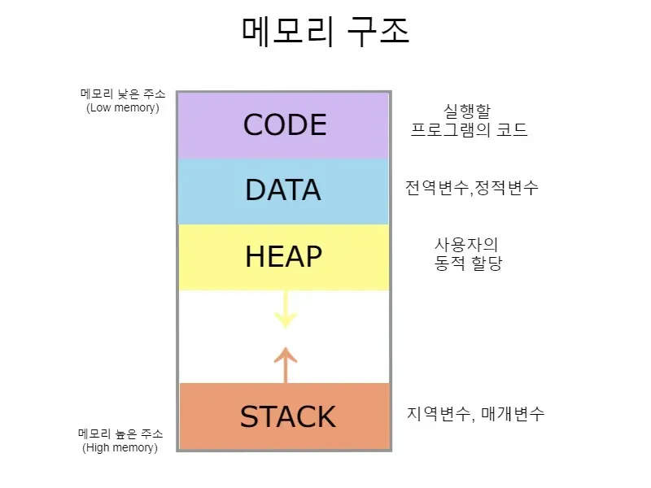
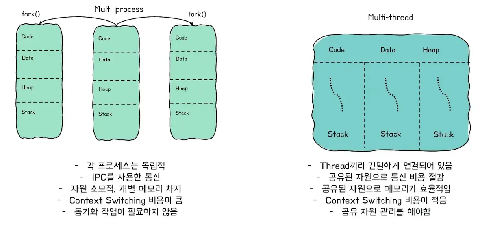

# Q1. 병렬과 동시성의 차이점을 말해주세요.

### ✅ 답변 !!
병렬이란 **멀티 코어 환경**에서 여러 실행 단위 (프로세스, 스레드)가 **동시에 실행**되는 것을 의미하며,  

동시성이란 **싱글 코어 환경**에서 **Context Switching**을 통해 여러 실행 단위가 **번갈아 수행**하는 방식을 의미합니다.  

---

### 🔎 추가 설명
  
- **Core**란 CPU 내부의 개별적인 처리 장치를 의미한다.  

  
- 프로세스의 **준비 ↔ 실행** 과정에서 Context Switching 발생  

---

# Q2. 스레드와 프로세스 차이를 말해주세요.

### ✅ 답변 !!
- **프로세스(Process)**: 운영체제로부터 자원을 할당받은 작업의 단위  
- **스레드(Thread)**: 프로세스가 할당받은 자원을 이용하는 실행 흐름 단위  

or  

- 프로세스는 **실행 중인 프로그램**으로, 독립된 메모리 공간을 갖고 하나 이상의 스레드를 포함  
- 스레드는 프로세스 내 실행 단위로, **Stack은 독립적**이고 나머지 자원은 공유  

---

### 🔎 추가 설명

#### 📂 프로세스의 메모리 구조
  

- 스레드는 **code, data, heap 영역을 공유**하며 각각의 **stack**을 가지고 있음  

---

## 🚀 멀티프로세스 vs 멀티스레드

- **멀티프로세스**: 여러 **독립된 메모리 공간**을 가진 프로세스가 동시에 실행  
- **멀티스레드**: **하나의 프로세스 안에서 메모리를 공유**하며 여러 실행 흐름이 동시에 수행  

---

### 📊 비교 표

| 구분 | 장점 | 단점 |
| --- | --- | --- |
| **멀티프로세스** | - **프로그램 안정성**: 하나의 프로세스가 비정상 종료되어도 다른 프로세스에는 영향 없음 → 전체 안정성↑   - **시스템 확장성**: 독립적 구조라 새로운 기능/모듈 추가 시 영향 없음   - **보안성**: 프로세스 간 메모리 공간이 분리되어 직접 침범 어려움 | - **Context Switching 비용↑**: PCB 교체 + 메모리 매핑 비용 커서 오버헤드 큼   - **자원 공유 비효율성**: IPC(파이프, 소켓, 메시지 큐 등) 필요 → 구현 복잡 & 성능 저하 |
| **멀티스레드** | - **자원 효율성**: 동일 프로세스 메모리를 공유 → 효율 ↑   - **Context Switching 비용↓**: 같은 프로세스 내에서 스택/레지스터만 교체 → 오버헤드 작음   - **응답 시간 단축**: I/O 대기 중에도 다른 스레드 실행 가능   - **데이터 공유 용이**: 전역 변수/힙 공유로 통신 간단 | - **안정성↓**: 하나의 스레드 오류가 전체 프로세스에 영향 → 프로그램 종료 위험   - **동기화 어려움**: Race Condition → Mutex/Semaphore/Lock 필요   - **디버깅 어려움**: 실행 순서 불확정, 재현 어렵다   - **교착상태(Deadlock)** 가능성: 잘못된 락 사용 시 시스템 정지 |

---
