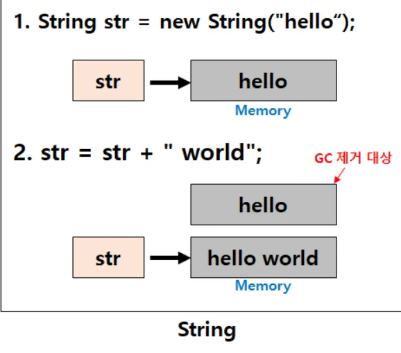
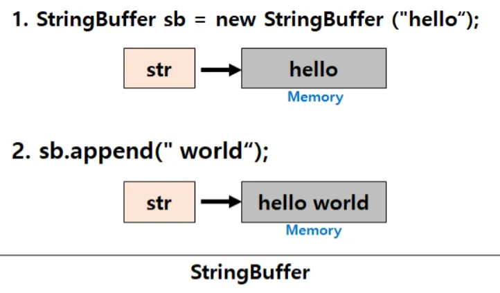

# Q1. String, StringBuilder, StringBuffer의 차이점은 ?

### ✅ 답변 !
3가지 모두 **문자열**을 다루는 자료형 클래스이나

**String**은 한 번 생성되면 값을 변경할 수 없는 **불변 객체**, 
**StringBuilder**와 **StringBuffer**는 문자열을 추가하거나 수정할 수 있는 **가변 객체**입니다. 
또한, **StringBuffer**는 멀티 스레드 환경에서 **안전한 동기화를 지원**하지만, **StringBuilder**는 이를 **지원하지 않아** 싱글 스레드 환경에서 더 빠른 성능을 제공합니다.

---

## 🔎 추가 설명

### 1. String
```java
String  str  =  "hello";       //  String str = new String("hello");
str  =  str  +   "world";        //  [  hello  world  ]
```
- str은 “hello world” 라는 값을 가지고 있는 새로운 메모리 영역을 가리키게 변경
- 처음 선언했던 “hello” 로 값이 할당되어 있던 메모리 영역은 GC에 의해 제거
  → String 클래스는 불변하기 때문에 문자열을 수정하는 시점에 새로운 String 인스턴스 생성 !
- String pool 에 저장
- 불변성 특징으로 thread-safe



- 변하지 않는 문자열을 자주 조회할 경우 성능이 좋음  
- 문자열 추가, 수정, 삭제 등 연산이 빈번하게 발생하는 경우 힙 메모리에 많은 Garbage가 생성되어 성능에 영향

**자바에서 String을 불변으로 설정한 이유**
1. 캐싱  
2. 보안  
3. 동기화  


### 2. StringBuffer / StringBuilder
- **가변 객체** → 동일 객체 내에서 문자열 변경 가능  
- 힙 영역에 저장  
- 메모리 블럭에서 길이 변경 가능  
  - 기본 길이 16으로 생성  
  - `.append()` 시 자동 확장  



#### StringBuffer
- 내부적으로 **synchronized** 사용  
- 멀티스레드 환경에서 **thread-safe**  
- 동기화로 인해 성능은 `StringBuilder`보다 느림  

💡 **synchronized 키워드란?**  
여러 스레드가 동시에 하나의 자원에 접근하려고 할 때,  
현재 사용 중인 스레드를 제외하고는 접근하지 못하도록 막는 역할  

#### StringBuilder
- 동기화 미지원  
- 단일 스레드 환경에서 성능 우수 (빠름)  
- 멀티스레드 환경에서는 동시 접근 시 데이터 손실 발생

예시)
StringBuilder, StringBuffer 객체에 각각 1요소를 1만번 append 로직 수행 시?

```java
import java.util.*;

public class Main extends Thread{
  public static void main(String[] args) {
    StringBuffer stringBuffer = new StringBuffer();
    StringBuilder stringBuilder = new StringBuilder();

    new Thread(() -> {
        for(int i=0; i<10000; i++) {
            stringBuffer.append(1);
            stringBuilder.append(1);
        }
    }).start();

    new Thread(() -> {
        for(int i=0; i<10000; i++) {
            stringBuffer.append(1);
            stringBuilder.append(1);
        }
    }).start();

    new Thread(() -> {
        try {
            Thread.sleep(2000);

            System.out.println("StringBuffer.length: "+ stringBuffer.length()); // thread safe 함
            System.out.println("StringBuilder.length: "+ stringBuilder.length()); // thread unsafe 함
        } catch (InterruptedException e) {
            e.printStackTrace();
        }
    }).start();
  }
}

//출력
// StringBuffer.length: 20000
// StringBuilder.length: 19628
```
- StringBuilder의 출력 값이 더 작다.
- 쓰레드들이 동시에 StringBuilder 클래스에 접근하여 동시에 append() 수행 중 누락
- StringBuilder는 thread safe 하지 않아서 각기 쓰레드가 객체에 접근해서 변경을 하면 기다려주지 않기 때문
  
---

# Q2. thread-safe 란?

### ✅ 답변 !
멀티스레드 환경에서 스레드가 동시에 해당 코드나 데이터를 접근하더라도 프로그램의 실행 결과가 올바르게 유지되는 것을 의미

코드가 여러 스레드로부터 동시에 호출되더라도 각 스레드의 실행 경로가 서로를 방해하지 않도록 안전하게 설계되어 있다는 것

→ 데이터 무결성 & 일관성

---

## 🔎 추가 설명

### thread-safe를 보장하기 위한 방법
1. **상호배제 (Mutual Exclusion)**  
   - 세마포어, 뮤텍스를 활용하여 공유 자원에 하나의 thread만 접근 허용  
2. **동기화 (Synchronization)**  
3. **불변성 (Immutability)**  
4. **스레드 로컬 저장소 (ThreadLocal)**  
5. **원자적 연산 (Atomic Operation)**  

📌 참고 링크  
- https://developer-ellen.tistory.com/205  
- [스레드 세이프란?](https://happydhkim.tistory.com/entry/%EC%8A%A4%EB%A0%88%EB%93%9C-%EC%84%B8%EC%9D%B4%ED%94%84Thred-Safe%EB%9E%80)

---

### Java에서 thread-safe하게 설계하는 방법
1. **`java.util.concurrent` 패키지 활용**  

  ```java
   Map<K,V> map = new ConcurrentHashMap<K,V>();
   Queue<E> queue = new ConcurrentQueue<E>();
  ``` 

- Concurrent 자료구조를 사용하면 동시 작업할 수 있는 스레드 양을 설정할 수 있다.
- 병렬성을 최대한 확보한 자료 구조

2. **인스턴스 변수를 두지 않는다**  
- `private final` 사용  
- 데이터를 바꿀 수 있는 setter 메소드 제공하지 않기 

3. **Singleton 패턴 사용**  
- `enum` 활용 (JVM 보장, thread-safe 자동 확보)  

4. **동기화 블럭에서 연산 수행**  
- `synchronized` 키워드 사용 (메서드, 코드 블럭)  
- 스레드가 synchronized 자료구조에 접근하면 lock을 걸고 다른 스레드의 접근을 제한한다.

   ```java
    public static synchronized void add(int value){
      count += value;
    }
   ```

---
