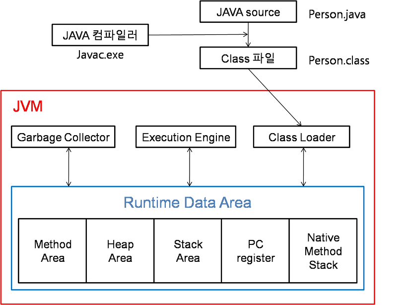

# Q1. **poll()과 remove() 의 차이 ?**

## 답변 
    
    poll과 remove 모두 큐에서 가장 앞에 있는 값을 제거하고 반환하는 메서드
    
    poll은 큐가 비어있을 경우 null 반환 
    
    remove는 큐가 비어있을 경우 NoSuchElementException 발생
    

## +) add()와 offer()의 차이?

## 답변
    
    add, offer 모두 큐에서 맨 뒤에 값을 넣는 메서드, 값 추가 시 true 반환
    
    add는 큐의 공간이 없을 경우 IllegalStateException 발생
    
    offer는 큐의 공간이 없을 경우 false 반환
    

## +) element()와 peek()의 차이?

## 답변
    
    element, peek 모두 큐의 맨 앞에 있는 값 반환
    
    element는 큐가 비어있을 경우 NoSuchElementException 발생
    
    peek는 큐가 비어있을 경우 null 반환
    
 

---

 

# Q2. JVM 구조?

## 답변
    
    JVM은 클래스 로더, 런타임 데이터 영역, 실행엔진, GC(Garbage Collector)로 구성
    
### 추가 설명
    
    💡 **JVM 이란?**
    
    Java Virtual Machine 자바 가상 머신.
    
    자바와 운영체제 사이에서 중개자 역할을 수행하며, 자바가 운영체제 구애 받지 않고 프로그램을 실행할 수 있도록 도와준다. 
    
    

자바 컴파일러에 의해 자바 소스 파일이 바이트 코드로 변환

이러한 바이트 코드를 JVM에서 읽어들인 다음 어떤 운영체제든간에 프로그램을 실행할 수 있도록 함

#### 1. **Class Loader** 
    - JVM 내로 클래스 파일 로딩 ( * 클래스 파일 안에 자바 바이트 코드가 들어간다. )
    - 링크를 통해 배치하는 작업 수행
    - 런타임 시 동적으로 클래스 로드
#### 2. **Runtime Data Area**
    - JVM의 메모리 영역
    
    - 자바 애플리케이션을 실행할 때 사용되는 데이터들을 적재하는 영역
    
        1) Method Area
            - 모든 쓰레드가 공유하는 메모리 영역
            - 클래스, 인터페이스, 메소드, 필드, Static 변수 등의 바이트 코드 보관
        2) Heap Area
            - 모든 쓰레드가 공유하는 영역
            - new 키워드로 생성된 객체와 배열이 생성되는 영역
            - 메소드 영역에 로드 된 클래스만 생성 가능
            - GC 대상
        3) Stack Area
            - 메서드 호출 마다 각각의 Stack 영역이 생성 됨
            - 메서드 안에서 사용되는 값 임시 저장
                - 호출된 메서드의 매개변수, 지역변수, 리턴 값 등 연산 시 일어나는 값
            - 메서드 수행 끝날 시 삭제
        4) PC register
            - 쓰레드 시작 시 생성 ( 쓰레드마다 하나씩 존재 )
            - 현재 수행 중인 JVM 명령의 주소 저장
        5) Native Method Stack
            - Java 외 다른 언어로 작성 된 코드를 위한 메모리 영역
#### 3. **Execution Engine**
    - 클래스 로더를 통해 JVM 내의 Runtime Data Area에 배치된 바이트 코드들을 명령어 단위로 읽어서 실행
    
    - **인터프리터 방식**을 사용하다가 일정한 기준이 넘어가면 **JIT 컴파일러 방식**으로 실행
        추가! ) 인터프리터 방식 & JIT 컴파일러 방식 ?
            - 인터프리터 방식
                - 바이트 코드 명령어를 하나씩 읽어서 해석하고 바로 실행
                - 느리다
            - JIT 방식
                - 바이트 코드 전체를 컴파일 후 Native Code로 변경하고 이후에는 해당 메서드를 더 이상 인터프리팅 하지 않고 **캐싱**해 두었다가 네이티브 코드로 직접 실행하는 방식
                - 빠르지만 비용 소요
#### 4. **Garbage Collector**
    - 힙 메모리 영역에 생성된 객체들 중에서 참조되지 않는 객체들을 탐색 후 제거하는 역할
    
    - GC가 언제 수행되는지는 정확히 알 수 없다
