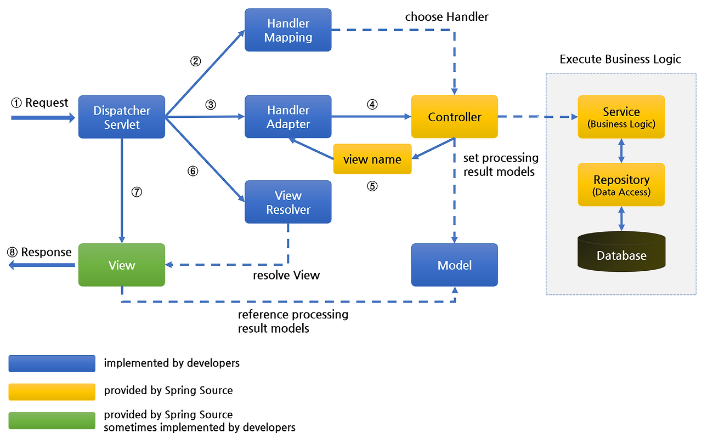

# Q1. Srping Framwork에 대해서 설명해주세요.

 

## 답변 !
스프링 프레임워크는 자바 개발을 편리하게 해주는 오픈 소스 프레임워크 입니다. 

스프링 프레임워크의 특징으로는 다음이 있습니다. 

- **경량 컨테이너**로서 자바 객체를 직접 관리
    
    객테의 생성 및 소멸 그리고 라이프 사이클을 관리하며 언제든 Spring 컨테이너로부터 필요한 객체를 가져와 사용할 수 있다. 
    
    Spring 이 IoC기반의 Framework임을 의미
    
- **제어의 역전(IoC)** 을 통해 어플리케이션의 느슨한 결합을 도모
    
    인스턴스의 제어권이 개발자가 아니라 컨테이너(프레임워크)가 대신 관리.
    
    필요에 따라 스프링에서 사용자의 코드를 호출한다.
    
- **의존성 주입(DI)** 을 지원
    1. 생성자 삽입 (final) - 권장
    2. 수정자 주입 (Setter) - 비권장
    3. 필드 주입
- **관점 지향 프로그래밍(AOP)** 지원
    
    여러 모듈에서 공통으로 사용되는 기능(트랜잭션, 로깅, 보안 등)을 외부 독립된 클래스로 분리하는 것을 의미.
    
    공통 로직과 핵심 비즈니스 로직을 분리하여 응집도를 높여 개발할 수 있다.
    
- **POJO (Plain Old Java Object)** 기반의 구성
    
    “오래된 방식의 간단한 자바 오브젝트”
    
    POJO는 getter/setter를 가진 단순 자바 오브젝트로 정의
    
    이러한 단순 오브젝트는 의존성이 없고, 코드가 심플하여 추후 테스트 및 유지보수가 편리한 유연성의 장점을 가진다.
    
 
 
 

# Q2. Spring MVC 는 어떠한 흐름으로 요청을 처리하는 지 설명해주세요.

 

## 답변 !

먼저 클라이언트의 **요청**이 들어오면 **DispatcherServlet**이 이를 받고, 

**HandlerMapping**을 통해 어떤 컨트롤러가 처리할지 찾습니다.

그 다음 **HandlerAdapter**가 해당 컨트롤러를 실행할 수 있도록 호출하고, 

**Controller**는 비즈니스 로직을 수행한 뒤 

결과 데이터를 **Model**에 담아 **View** 이름을 DispatcherServlet에 반환합니다. 

DisptcherServlet은 **ViewResolver**를 이용해 실제 View를 찾아 렌더링하고, 

최종적으로 **View**가 사용자에게 응답을 생성합니다. 

 

---
## 설명 !

## 1️⃣ DispatcherServlet

**역할**

Spring MVC의 핵심 프론트 컨트롤러로, 모든 요청을 받아 처리 흐름을 제어한다.

**동작**

1. 클라이언트로부터 요청을 받는다.
2. HandlerMapping을 호출하여 어떤 컨트롤러가 요청을 처리할지 조회한다.
3. HandlerAdapter를 통해 해당 컨트롤러를 실행한다.
4. 컨트롤러의 실행 결과(ModelAndView)를 받아 ViewResolver를 통해 뷰를 찾고 렌더링한다.

**보충 설명**

- Spring이 자동 등록하며, web.xml 또는 Spring Boot에서 자동 구성된다.
- 요청–응답의 전체 흐름을 관리하는 **중앙 조정자(Front Controller)** 역할을 한다.

---

## 2️⃣ HandlerMapping

**역할**

요청 URL을 분석해 어떤 Controller가 요청을 처리할지를 결정한다.

**동작**

- DispatcherServlet이 전달한 요청 정보를 기반으로 URL 패턴에 맞는 컨트롤러를 반환한다.

**보충 설명**

- 설정 방식: XML, Java Config, 어노테이션(@RequestMapping) 등
- URL, HTTP 메서드(GET/POST 등), 파라미터 조건에 따라 매핑된다.
- 예시: `@GetMapping("/home")` → `HomeController.home()` 실행

---

## 3️⃣ HandlerAdapter

**역할**

HandlerMapping이 찾아준 Controller를 실제로 실행 가능한 형태로 호출한다.

**동작**

1. 컨트롤러 타입에 맞는 어댑터 선택
2. 컨트롤러 메서드 실행 및 결과(ModelAndView) 반환

**보충 설명**

- 다양한 어댑터 구현체 존재: `RequestMappingHandlerAdapter`, `HttpRequestHandlerAdapter` 등
- 서로 다른 형태의 컨트롤러를 동일한 방식으로 실행할 수 있게 함 (유연성 확보)

---

## 4️⃣ Controller

**역할**

비즈니스 로직을 수행하고, 처리 결과를 모델(Model)에 담아 뷰로 전달한다.

**동작**

1. 요청을 받아 서비스 로직 수행
2. 결과 데이터를 Model 객체에 저장
3. View 이름(View Name)을 반환

**보충 설명**

- 어노테이션: `@Controller`, `@RestController`
- 웹 요청과 비즈니스 로직 사이의 **중간 계층 역할**
- REST API의 경우, View 대신 JSON 응답(`ResponseEntity`)을 반환한다.

---

## 5️⃣ ModelAndView

**역할**

Controller에서 생성한 데이터(Model)와 View 이름(View Name)을 함께 저장하는 객체이다.

**보충 설명**

- DispatcherServlet은 이 객체를 이용해 ViewResolver로 전달한다.
- 단순 데이터만 전달할 경우 `Model`, `ModelMap`으로 대체 가능하다.
- REST API에서는 생략되고 JSON으로 바로 응답한다.

---

## 6️⃣ ViewResolver

**역할**

Controller가 반환한 View Name을 실제 View 파일로 변환한다.

**동작**

1. View Name을 기반으로 prefix/suffix를 조합해 View 경로 생성
2. 해당 View 객체를 DispatcherServlet에 반환

**보충 설명**

- 대표 구현체: `InternalResourceViewResolver`
- JSP, Thymeleaf, FreeMarker 등 다양한 템플릿 엔진과 연동 가능

---

## 7️⃣ View

**역할**

Controller로부터 전달받은 데이터를 기반으로 사용자에게 보이는 최종 화면을 생성한다.

**동작**

- HTML, JSP, JSON 등의 형태로 렌더링되어 클라이언트에게 응답한다.

**보충 설명**

- View의 종류: JSP, Thymeleaf, Mustache, JSON 등
- MVC 패턴의 최종 단계로, 데이터를 시각적으로 표현하는 역할을 맡는다.
